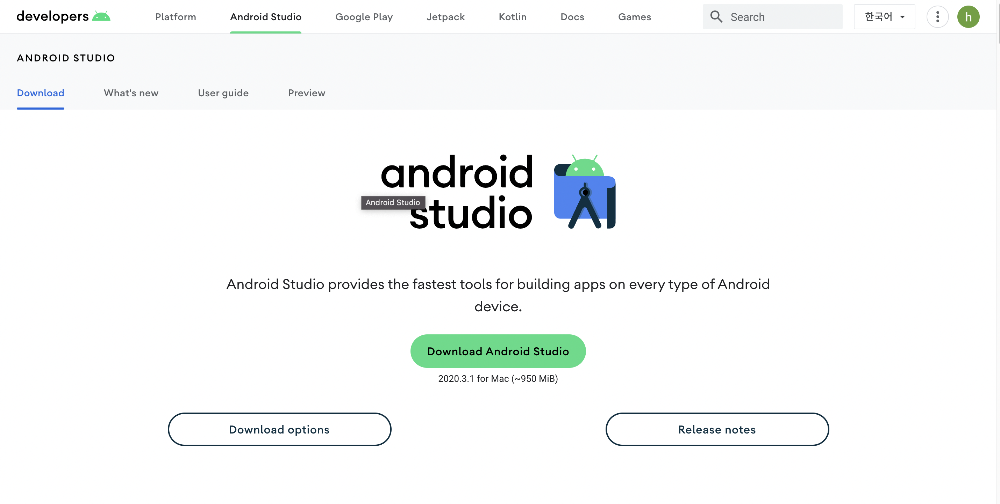
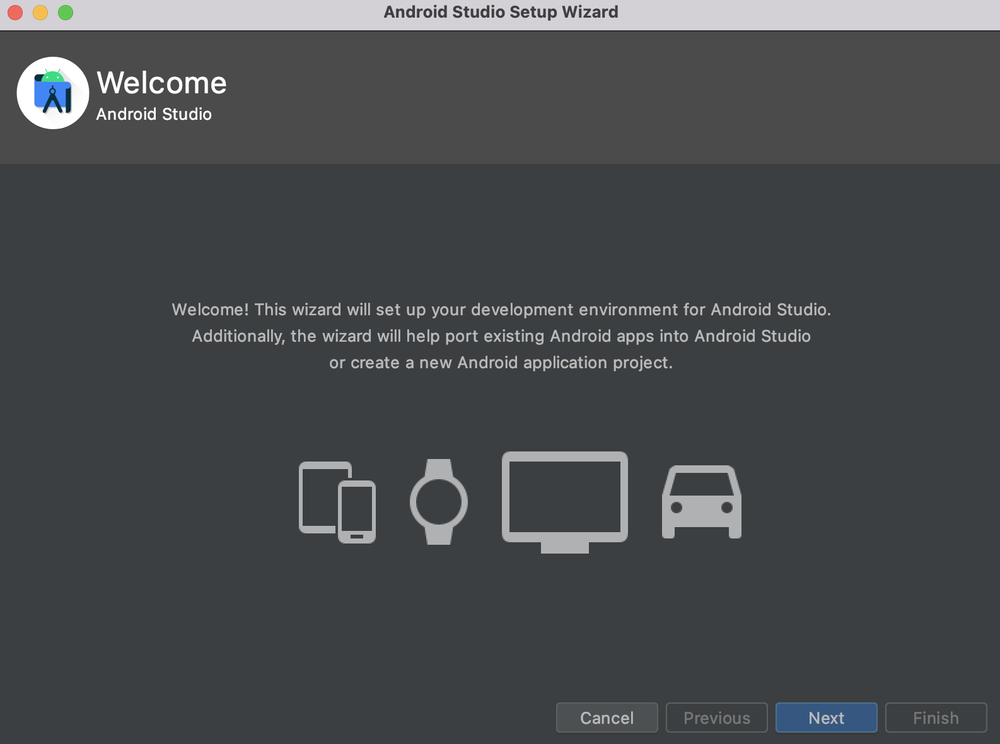
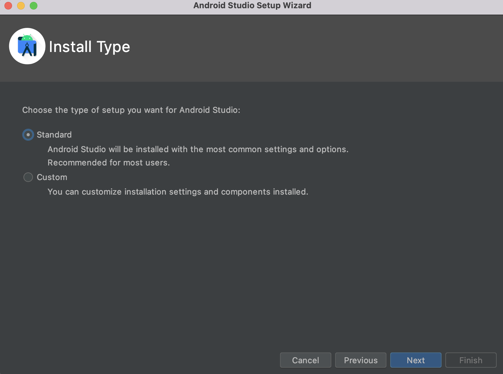
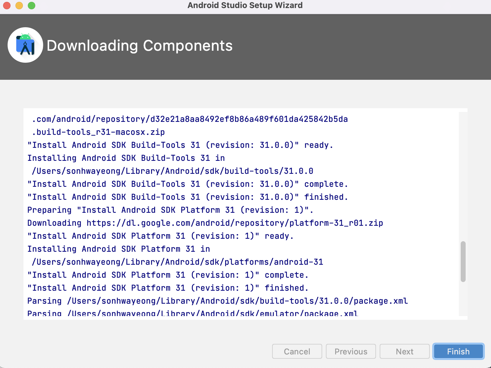
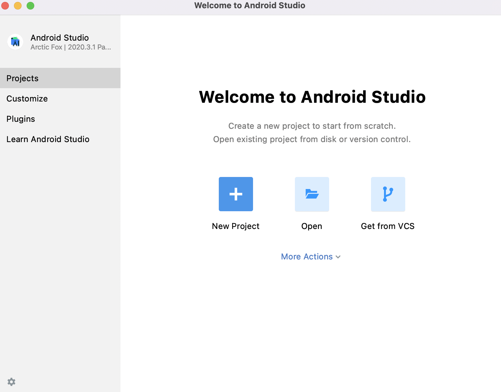

### 안드로이드 스튜디오 설치

   *다운로드 경로 https://developer.android.com/studio/

   1-1. 사이트로 이동하여 'download Andorid Studio'라 적혀 있는 초록색 버튼을 클릭합니다.

​    

​	1-2. 동의를 위한 팝업창이 나타나면 스크롤을 내려 체크박스에 클릭합니다.

​	 1-3.  체크박스 선택 후 아래의 버튼이 활성화되고 "M1칩"의 경우 오른쪽에 있는 'Mac with apple chip' 버튼을 클릭합니다.

​	 1-4. 다운로드 완료가 되면 압축을 해제한 후 생성된 안드로이드 스튜디오를 응용프로그램으로 이동시킵니다. 

### 안드로이드 스튜디오 설정

   2-1. 'Do not import Settings' 선택된 상태에서 'OK'버튼 클릭합니다.

   2-2. [Data Sharing] 창이 나오면, 'Don't send' 클릭합니다. 다음과 같은 화면이 나옵니다.

      	

​	2-3. "Next"버튼클릭, 원하는 UI 선택 후 'finish' 클릭 

	

​	2-4. 다운로드 완료 후 'finish' 클릭

​	2-5. 완료!

